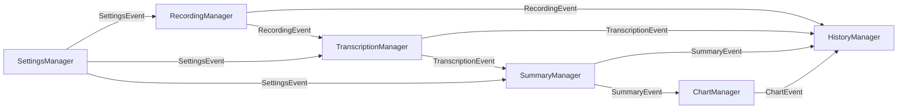

# AI 录音助手 — API 设计文档（API Design）

## 版本信息

| 项目 | 内容 |
|------|------|
| 文档版本 | v1.0 |
| 撰写日期 | 2026/05/28 |
| 对应 PRD | PRD-v1.0.md |
| 对应 Tech Spec | TechSpec-v1.0.md |
| 对应 Database | DatabaseDesign-v1.0.md |
| 文档状态 | 已确认，可直接指导开发 |

---

## 1. 设计原则

### 1.1 接口分层

| 层级 | 说明 | 通信方式 |
|------|------|----------|
| **内部模块接口** | 应用内部各模块间的业务逻辑交互 | Swift Protocol + Combine 异步流 |
| **服务层接口** | 业务模块与底层服务（录音、转录、AI）的交互 | Swift Protocol + async/await |
| **外部服务接口** | 与第三方云端 API（OpenAI）的交互 | HTTP REST API + JSON |

### 1.2 设计约束

- **类型安全**：所有接口使用 Swift 强类型，避免 `Any` 或裸字典
- **异步优先**：所有可能阻塞的接口使用 `async/await` 或 Combine
- **错误显式**：使用 `Result` 类型或 `throws`，错误信息可追踪
- **向后兼容**：外部 API 调用支持版本降级，内部接口通过协议扩展兼容

---

## 2. 内部模块间接口

### 2.1 模块接口总览



### 2.2 录音模块接口（RecordingModule）

#### 2.2.1 录音管理器协议

```swift
// MARK: - 事件定义

enum RecordingEvent {
    case started(Recording)
    case paused(Recording)
    case resumed(Recording)
    case stopped(Recording)
    case failed(Recording, RecordingError)
    case progress(Recording, elapsedTime: TimeInterval)
}

enum RecordingError: Error {
    case permissionDenied(source: AudioSource)
    case deviceUnavailable(source: AudioSource)
    case diskSpaceInsufficient(needed: Int64, available: Int64)
    case encodingFailed(underlying: Error)
    case fileIOFailed(path: String, underlying: Error)
    case alreadyRecording
    case notRecording
    case invalidConfiguration
}

enum AudioSource: Int, CaseIterable {
    case microphone = 0
    case systemAudio = 1
    case mixed = 2
}

// MARK: - 录音管理器协议

protocol RecordingManagerProtocol: AnyObject {
    /// 当前录音状态
    var state: RecordingState { get }
    
    /// 状态变更事件流
    var statePublisher: AnyPublisher<RecordingState, Never> { get }
    
    /// 录音事件流（用于模块间通信）
    var eventPublisher: AnyPublisher<RecordingEvent, Never> { get }
    
    /// 开始录音
    func startRecording(source: AudioSource, configuration: RecordingConfiguration) async throws -> Recording
    
    /// 暂停录音
    func pauseRecording() async throws
    
    /// 继续录音
    func resumeRecording() async throws
    
    /// 停止录音
    func stopRecording() async throws -> Recording
    
    /// 获取当前录音的实时音量（用于波形显示）
    var audioLevelPublisher: AnyPublisher<Float, Never> { get }
}

// MARK: - 数据模型

struct RecordingConfiguration {
    var sampleRate: Double = 44100
    var channels: Int = 1
    var bitDepth: Int = 16
    var format: RecordingFormat = .wav
    var storageLocation: URL?
    var enableEncryption: Bool = false
}

enum RecordingFormat: String {
    case wav = "wav"
    case caf = "caf"
    case flac = "flac"
}

enum RecordingState: Equatable {
    case idle
    case preparing
    case recording(startTime: Date, source: AudioSource)
    case paused(startTime: Date, pausedDuration: TimeInterval, source: AudioSource)
    case stopping
    case error(RecordingError)
}
```

#### 2.2.2 录音服务协议

```swift
protocol AudioRecordingServiceProtocol: AnyObject {
    /// 检查并申请录音权限
    func requestPermission(for source: AudioSource) async -> Bool
    
    /// 检查权限状态
    func checkPermission(for source: AudioSource) -> PermissionStatus
    
    /// 开始录制
    func start(configuration: RecordingConfiguration) async throws -> AudioRecordingSession
    
    /// 停止录制
    func stop(session: AudioRecordingSession) async throws -> URL
    
    /// 获取可用音频输入设备
    func availableInputDevices() -> [AudioDevice]
}

enum PermissionStatus {
    case granted
    case denied
    case notDetermined
}

struct AudioDevice: Identifiable {
    let id: String
    let name: String
    let type: AudioDeviceType
}

enum AudioDeviceType {
    case builtInMicrophone
    case externalMicrophone
    case virtualAudioDevice
}

protocol AudioRecordingSession {
    var id: UUID { get }
    var startTime: Date { get }
    var configuration: RecordingConfiguration { get }
    var audioLevelPublisher: AnyPublisher<Float, Never> { get }
    
    func pause() async throws
    func resume() async throws
    func stop() async throws -> URL
}
```

### 2.3 转录模块接口（TranscriptionModule）

#### 2.3.1 转录管理器协议

```swift
// MARK: - 事件定义

enum TranscriptionEvent {
    case started(Transcription)
    case progress(Transcription, percentage: Double)
    case completed(Transcription)
    case failed(Transcription, TranscriptionError)
}

enum TranscriptionError: Error {
    case audioFileNotFound(path: String)
    case audioFileCorrupted(path: String)
    case engineNotAvailable(engine: TranscriptionEngine)
    case recognitionFailed(engine: TranscriptionEngine, underlying: Error)
    case speakerDiarizationFailed(underlying: Error)
    case languageNotSupported(language: String)
    case timeout(duration: TimeInterval)
    case cancelled
    case invalidAudioFormat
}

enum TranscriptionEngine: Int, CaseIterable {
    case appleSpeech = 0
    case whisperSmall = 1
    case whisperTiny = 2
}

// MARK: - 转录管理器协议

protocol TranscriptionManagerProtocol: AnyObject {
    /// 转录事件流
    var eventPublisher: AnyPublisher<TranscriptionEvent, Never> { get }
    
    /// 开始转录（自动触发）
    func transcribe(recording: Recording, options: TranscriptionOptions?) async throws -> Transcription
    
    /// 重新转录（用户手动触发）
    func retranscribe(recording: Recording, options: TranscriptionOptions) async throws -> Transcription
    
    /// 取消转录
    func cancelTranscription(for recordingId: UUID) async
    
    /// 获取转录状态
    func transcriptionStatus(for recordingId: UUID) -> TranscriptionStatus
    
    /// 获取可用的转录引擎
    func availableEngines() -> [TranscriptionEngine]
}

struct TranscriptionOptions {
    var engine: TranscriptionEngine?
    var language: String?           // "zh-CN", "en-US", nil=自动检测
    var enableSpeakerDiarization: Bool = true
    var speakerCount: Int?          // nil=自动估计
    var priority: TranscriptionPriority = .normal
}

enum TranscriptionPriority {
    case low
    case normal
    case high
}

enum TranscriptionStatus {
    case notStarted
    case queued
    case processing(progress: Double)
    case completed(Transcription)
    case failed(TranscriptionError)
}
```

#### 2.3.2 本地转录服务协议

```swift
protocol LocalTranscriptionServiceProtocol: AnyObject {
    /// 支持的引擎类型
    var supportedEngines: [TranscriptionEngine] { get }
    
    /// 检查引擎是否就绪（模型是否已下载/加载）
    func isEngineReady(_ engine: TranscriptionEngine) -> Bool
    
    /// 预加载引擎模型
    func preloadEngine(_ engine: TranscriptionEngine) async throws
    
    /// 执行语音识别
    func recognize(
        audioFile: URL,
        engine: TranscriptionEngine,
        language: String?,
        progressHandler: ((Double) -> Void)?
    ) async throws -> [TranscriptionSegment]
    
    /// 取消当前识别任务
    func cancelRecognition()
}

protocol SpeakerDiarizationServiceProtocol: AnyObject {
    /// 检查模型是否就绪
    var isModelLoaded: Bool { get }
    
    /// 加载模型
    func loadModel() async throws
    
    /// 执行说话人分离
    func diarize(
        audioFile: URL,
        expectedSpeakers: Int?,
        progressHandler: ((Double) -> Void)?
    ) async throws -> [SpeakerSegment]
    
    /// 取消当前任务
    func cancelDiarization()
}

struct SpeakerSegment {
    let startTime: TimeInterval
    let endTime: TimeInterval
    let speakerId: String
    let confidence: Double
}
```

### 2.4 纪要模块接口（SummaryModule）

#### 2.4.1 纪要管理器协议

```swift
// MARK: - 事件定义

enum SummaryEvent {
    case started(Summary)
    case progress(Summary, stage: SummaryStage, percentage: Double)
    case completed(Summary)
    case failed(Summary, SummaryError)
}

enum SummaryStage {
    case preprocessing      // 文本预处理
    case aiGenerating       // AI 生成中
    case postprocessing     // 结果后处理
}

enum SummaryError: Error {
    case transcriptionNotFound(recordingId: UUID)
    case transcriptionEmpty
    case textTooLong(length: Int, maxLength: Int)
    case aiServiceUnavailable
    case aiRequestFailed(statusCode: Int, message: String)
    case aiResponseInvalid(underlying: Error)
    case rateLimited(retryAfter: TimeInterval)
    case networkError(underlying: Error)
    case cancelled
    case parsingFailed(rawResponse: String)
}

enum SummaryStyle: String, CaseIterable {
    case detailed = "detailed"
    case concise = "concise"
    case actionItems = "actionItems"
}

// MARK: - 纪要管理器协议

protocol SummaryManagerProtocol: AnyObject {
    /// 纪要事件流
    var eventPublisher: AnyPublisher<SummaryEvent, Never> { get }
    
    /// 生成纪要（自动触发）
    func generateSummary(for recording: Recording, style: SummaryStyle?) async throws -> Summary
    
    /// 重新生成纪要
    func regenerateSummary(for recording: Recording, style: SummaryStyle) async throws -> Summary
    
    /// 取消生成
    func cancelGeneration(for recordingId: UUID) async
    
    /// 更新纪要内容（用户手动编辑）
    func updateSummary(_ summary: Summary, markdownContent: String) async throws -> Summary
    
    /// 获取本地降级摘要（离线模式）
    func generateLocalSummary(for recording: Recording) async throws -> Summary
}
```

#### 2.4.2 云端 AI 服务协议

```swift
protocol CloudAIServiceProtocol: AnyObject {
    /// 检查服务可用性
    func checkAvailability() async -> Bool
    
    /// 生成会议纪要
    func generateMeetingSummary(
        transcription: Transcription,
        style: SummaryStyle,
        language: String
    ) async throws -> AISummaryResponse
    
    /// 生成图表定义（Mermaid）
    func generateChartDefinition(
        summary: Summary,
        chartType: ChartType
    ) async throws -> String  // Mermaid 语法字符串
}

struct AISummaryResponse {
    let theme: String
    let participants: [ParticipantInfo]
    let keyDecisions: [String]
    let actionItems: [ActionItemInfo]
    let timeline: [TimelineEvent]
    let markdownContent: String
    let rawJson: String
    let usage: TokenUsage
}

struct ParticipantInfo {
    let name: String
    let role: String?
}

struct ActionItemInfo {
    let content: String
    let assignee: String?
    let deadline: String?
}

struct TimelineEvent {
    let time: String
    let event: String
}

struct TokenUsage {
    let promptTokens: Int
    let completionTokens: Int
    let totalTokens: Int
}
```

### 2.5 图表模块接口（ChartModule）

```swift
enum ChartType: String, CaseIterable {
    case mindMap = "mindMap"
    case flowchart = "flowchart"
    case timeline = "timeline"
}

enum ChartExportFormat: String {
    case png = "png"
    case svg = "svg"
    case pdf = "pdf"
}

enum ChartError: Error {
    case invalidMermaidSyntax
    case renderingFailed(underlying: Error)
    case exportFailed(underlying: Error)
    case unsupportedChartType
}

protocol ChartManagerProtocol: AnyObject {
    /// 生成图表
    func generateChart(
        for recording: Recording,
        type: ChartType
    ) async throws -> Chart
    
    /// 导出图表为图片
    func exportChart(
        _ chart: Chart,
        format: ChartExportFormat,
        size: CGSize?
    ) async throws -> URL
    
    /// 更新图表定义（用户手动编辑 Mermaid）
    func updateChartDefinition(_ chart: Chart, mermaidDefinition: String) async throws -> Chart
    
    /// 预览图表（返回图片数据）
    func previewChart(mermaidDefinition: String) async throws -> Data
}

protocol ChartRenderingServiceProtocol: AnyObject {
    /// 渲染 Mermaid 定义为图片
    func render(mermaidDefinition: String, format: ChartExportFormat) async throws -> Data
    
    /// 验证 Mermaid 语法
    func validateSyntax(_ mermaidDefinition: String) -> Bool
}
```

### 2.6 历史管理模块接口（HistoryModule）

```swift
enum SearchScope {
    case all
    case title
    case transcription
    case summary
}

enum SortOrder {
    case dateDescending
    case dateAscending
    case durationDescending
    case durationAscending
}

protocol HistoryManagerProtocol: AnyObject {
    /// 获取录音列表（分页）
    func fetchRecordings(
        page: Int,
        pageSize: Int,
        sortOrder: SortOrder,
        filter: RecordingFilter?
    ) async throws -> [Recording]
    
    /// 搜索录音
    func searchRecordings(
        query: String,
        scope: SearchScope,
        page: Int,
        pageSize: Int
    ) async throws -> [SearchResult]
    
    /// 获取录音详情
    func getRecordingDetail(id: UUID) async throws -> RecordingDetail
    
    /// 删除录音（软删除）
    func deleteRecording(id: UUID) async throws
    
    /// 永久删除录音
    func permanentlyDeleteRecording(id: UUID) async throws
    
    /// 恢复已删除录音
    func restoreRecording(id: UUID) async throws
    
    /// 更新录音信息
    func updateRecording(id: UUID, title: String?, isFavorite: Bool?) async throws
    
    /// 导出录音包
    func exportRecording(id: UUID, includeAudio: Bool) async throws -> URL
    
    /// 批量导出
    func batchExport(recordingIds: [UUID], format: ExportFormat) async throws -> URL
}

struct RecordingFilter {
    var dateRange: ClosedRange<Date>?
    var sourceType: AudioSource?
    var status: RecordingStatus?
    var isFavorite: Bool?
    var tagIds: [UUID]?
}

struct SearchResult {
    let recording: Recording
    let matchType: SearchScope
    let matchedText: String
    let relevanceScore: Double
}

struct RecordingDetail {
    let recording: Recording
    let transcription: Transcription?
    let summary: Summary?
    let speakers: [Speaker]
    let charts: [Chart]
    let tags: [Tag]
}

enum ExportFormat {
    case markdown
    case pdf
    case zip
}
```

### 2.7 设置模块接口（SettingsModule）

```swift
protocol SettingsManagerProtocol: AnyObject {
    /// 获取设置值
    func get<T: SettingValueType>(_ key: SettingKey<T>) -> T
    
    /// 设置值
    func set<T: SettingValueType>(_ key: SettingKey<T>, value: T) async throws
    
    /// 重置为默认值
    func resetToDefaults() async throws
    
    /// 设置变更事件
    var settingsChangedPublisher: AnyPublisher<SettingChangeEvent, Never> { get }
    
    /// 验证设置有效性
    func validateSettings() -> [SettingValidationError]
}

struct SettingKey<T: SettingValueType> {
    let rawKey: String
    let defaultValue: T
}

protocol SettingValueType {
    func toSettingString() -> String
    static func fromSettingString(_ string: String) -> Self?
}

struct SettingChangeEvent {
    let key: String
    let oldValue: String?
    let newValue: String
}

struct SettingValidationError {
    let key: String
    let message: String
}

// 预定义设置键
extension SettingKey {
    static let recordingSampleRate = SettingKey<Double>(rawKey: "recording.sampleRate", defaultValue: 44100)
    static let recordingFormat = SettingKey<String>(rawKey: "recording.format", defaultValue: "wav")
    static let transcriptionEngine = SettingKey<String>(rawKey: "transcription.engine", defaultValue: "appleSpeech")
    static let summaryCloudEnabled = SettingKey<Bool>(rawKey: "summary.cloudEnabled", defaultValue: true)
    static let storageEncryptionEnabled = SettingKey<Bool>(rawKey: "storage.encryptionEnabled", defaultValue: false)
}
```

---

## 3. 模块间事件总线

### 3.1 事件总线定义

```swift
/// 全局事件总线，用于模块间解耦通信
protocol AppEventBusProtocol {
    // MARK: - 录音事件
    var recordingStarted: AnyPublisher<Recording, Never> { get }
    var recordingStopped: AnyPublisher<Recording, Never> { get }
    var recordingFailed: AnyPublisher<(Recording, RecordingError), Never> { get }
    
    // MARK: - 转录事件
    var transcriptionStarted: AnyPublisher<Transcription, Never> { get }
    var transcriptionCompleted: AnyPublisher<Transcription, Never> { get }
    var transcriptionFailed: AnyPublisher<(Transcription, TranscriptionError), Never> { get }
    
    // MARK: - 纪要事件
    var summaryStarted: AnyPublisher<Summary, Never> { get }
    var summaryGenerated: AnyPublisher<Summary, Never> { get }
    var summaryFailed: AnyPublisher<(Summary, SummaryError), Never> { get }
    
    // MARK: - 图表事件
    var chartGenerated: AnyPublisher<Chart, Never> { get }
    
    // MARK: - 设置事件
    var settingsChanged: AnyPublisher<SettingChangeEvent, Never> { get }
    
    // MARK: - 发布方法
    func publish(_ event: AppEvent)
}

enum AppEvent {
    case recordingStarted(Recording)
    case recordingStopped(Recording)
    case recordingFailed(Recording, RecordingError)
    case transcriptionStarted(Transcription)
    case transcriptionCompleted(Transcription)
    case transcriptionFailed(Transcription, TranscriptionError)
    case summaryStarted(Summary)
    case summaryGenerated(Summary)
    case summaryFailed(Summary, SummaryError)
    case chartGenerated(Chart)
    case settingsChanged(SettingChangeEvent)
}
```

### 3.2 使用示例

```swift
// 转录模块订阅录音完成事件，自动触发转录
class TranscriptionManager: TranscriptionManagerProtocol {
    private let eventBus: AppEventBusProtocol
    private var cancellables = Set<AnyCancellable>()
    
    init(eventBus: AppEventBusProtocol) {
        self.eventBus = eventBus
        
        eventBus.recordingStopped
            .sink { [weak self] recording in
                Task {
                    try? await self?.transcribe(recording: recording, options: nil)
                }
            }
            .store(in: &cancellables)
    }
}

// 纪要模块订阅转录完成事件，自动触发纪要生成
class SummaryManager: SummaryManagerProtocol {
    private let eventBus: AppEventBusProtocol
    
    init(eventBus: AppEventBusProtocol) {
        self.eventBus = eventBus
        
        eventBus.transcriptionCompleted
            .sink { [weak self] transcription in
                Task {
                    guard let recording = transcription.recording else { return }
                    try? await self?.generateSummary(for: recording, style: nil)
                }
            }
            .store(in: &cancellables)
    }
}
```

---

## 4. 外部服务接口

### 4.1 OpenAI GPT-4o API 调用规范

#### 4.1.1 基础配置

| 配置项 | 值 |
|--------|-----|
| 基础 URL | `https://api.openai.com/v1` |
| 认证方式 | Bearer Token (`Authorization: Bearer {api_key}`) |
| 内容类型 | `application/json` |
| 超时设置 | 连接 10s，读取 120s |
| 重试策略 | 指数退避，最多 3 次 |

#### 4.1.2 纪要生成接口

**请求**：

```http
POST /v1/chat/completions
Content-Type: application/json
Authorization: Bearer {api_key}

{
  "model": "gpt-4o",
  "messages": [
    {
      "role": "system",
      "content": "你是一位专业的会议纪要整理助手。请根据以下会议转录文本，生成结构化的会议纪要。要求：1. 提取会议主题、参与人、关键决策、待办事项、时间线；2. 待办事项需包含负责人（如有提及）和截止日期（如有提及）；3. 使用 Markdown 格式输出；4. 忠实于原文，不虚构未提及的信息；5. 如果文本不是会议内容，请按内容类型（访谈/课堂/讲座）调整纪要结构。"
    },
    {
      "role": "user",
      "content": "请整理以下转录文本的纪要：\n\n{transcription_text}"
    }
  ],
  "response_format": {
    "type": "json_schema",
    "json_schema": {
      "name": "meeting_summary",
      "strict": true,
      "schema": {
        "type": "object",
        "properties": {
          "theme": { "type": "string" },
          "participants": {
            "type": "array",
            "items": {
              "type": "object",
              "properties": {
                "name": { "type": "string" },
                "role": { "type": ["string", "null"] }
              },
              "required": ["name"]
            }
          },
          "keyDecisions": {
            "type": "array",
            "items": { "type": "string" }
          },
          "actionItems": {
            "type": "array",
            "items": {
              "type": "object",
              "properties": {
                "content": { "type": "string" },
                "assignee": { "type": ["string", "null"] },
                "deadline": { "type": ["string", "null"] }
              },
              "required": ["content"]
            }
          },
          "timeline": {
            "type": "array",
            "items": {
              "type": "object",
              "properties": {
                "time": { "type": "string" },
                "event": { "type": "string" }
              },
              "required": ["time", "event"]
            }
          },
          "markdownContent": { "type": "string" }
        },
        "required": ["theme", "participants", "keyDecisions", "actionItems", "timeline", "markdownContent"]
      }
    }
  },
  "temperature": 0.3,
  "max_tokens": 4000
}
```

**响应**：

```http
HTTP/1.1 200 OK
Content-Type: application/json

{
  "id": "chatcmpl-xxx",
  "object": "chat.completion",
  "created": 1716883200,
  "model": "gpt-4o",
  "choices": [
    {
      "index": 0,
      "message": {
        "role": "assistant",
        "content": "{\"theme\":\"...\",\"participants\":[{\"name\":\"张三\"}],...}"
      },
      "finish_reason": "stop"
    }
  ],
  "usage": {
    "prompt_tokens": 1500,
    "completion_tokens": 800,
    "total_tokens": 2300
  }
}
```

#### 4.1.3 图表生成接口

**请求**：

```http
POST /v1/chat/completions
Content-Type: application/json
Authorization: Bearer {api_key}

{
  "model": "gpt-4o",
  "messages": [
    {
      "role": "system",
      "content": "请将以下会议纪要转换为 Mermaid 思维导图语法。只输出 Mermaid 代码，不要其他解释。"
    },
    {
      "role": "user",
      "content": "{summary_markdown}"
    }
  ],
  "temperature": 0.2,
  "max_tokens": 2000
}
```

**响应**：

```http
HTTP/1.1 200 OK
Content-Type: application/json

{
  "choices": [
    {
      "message": {
        "content": "mindmap\n  root((会议主题))\n    决策1\n    决策2\n      子决策\n"
      }
    }
  ]
}
```

### 4.2 错误响应处理

#### 4.2.1 OpenAI API 错误码

| HTTP 状态码 | 错误类型 | 处理方式 |
|-------------|----------|----------|
| 400 | Bad Request | 检查请求参数，记录日志，提示用户重试 |
| 401 | Unauthorized | API Key 无效，提示用户检查设置 |
| 429 | Rate Limited | 读取 `Retry-After` 头，指数退避重试 |
| 500 | Server Error | 重试 3 次，失败后降级本地摘要 |
| 503 | Service Unavailable | 重试 3 次，失败后降级本地摘要 |
| 超时 | Timeout | 重试 3 次，失败后降级本地摘要 |

#### 4.2.2 错误响应体

```json
{
  "error": {
    "message": "Rate limit reached for requests",
    "type": "requests",
    "param": null,
    "code": "rate_limit_exceeded"
  }
}
```

### 4.3 请求节流与缓存

```swift
protocol APIRateLimiter {
    /// 检查是否允许发送请求
    func canMakeRequest() -> Bool
    
    /// 记录请求发送
    func recordRequest()
    
    /// 获取下次可请求时间
    func nextAvailableTime() -> Date?
}

protocol APIResponseCache {
    /// 缓存响应
    func cacheResponse(_ response: Data, for request: URLRequest, ttl: TimeInterval)
    
    /// 获取缓存响应
    func getCachedResponse(for request: URLRequest) -> Data?
    
    /// 清除过期缓存
    func cleanupExpiredCache()
}
```

---

## 5. 数据序列化格式

### 5.1 内部数据序列化

| 场景 | 格式 | 说明 |
|------|------|------|
| 模块间传递 | Swift Codable 结构体 | 编译时类型安全 |
| 数据库存储 | Core Data 托管对象 | 自动持久化 |
| 配置文件 | JSON | 人类可读，便于调试 |
| 缓存数据 | JSON / MessagePack | JSON 便于调试，MessagePack 体积更小 |
| 导出文件 | JSON + Markdown | 跨平台兼容 |

### 5.2 核心模型序列化示例

```swift
// MARK: - 录音模型

struct RecordingDTO: Codable {
    let id: UUID
    let filePath: String
    let fileFormat: String
    let duration: Int
    let sampleRate: Int
    let channels: Int
    let bitDepth: Int
    let fileSize: Double
    let sourceType: Int
    let status: Int
    let title: String?
    let customTitle: String?
    let createdAt: Date
    let updatedAt: Date
    let isEncrypted: Bool
    let isFavorite: Bool
}

// MARK: - 转录模型

struct TranscriptionDTO: Codable {
    let id: UUID
    let recordingId: UUID
    let engine: Int
    let status: Int
    let language: String?
    let confidence: Double?
    let startedAt: Date?
    let completedAt: Date?
    let segments: [TranscriptionSegmentDTO]
}

struct TranscriptionSegmentDTO: Codable {
    let id: UUID
    let startTime: Double
    let endTime: Double
    let speakerId: String?
    let text: String
    let confidence: Double?
    let sequence: Int
}

// MARK: - 纪要模型

struct SummaryDTO: Codable {
    let id: UUID
    let recordingId: UUID
    let status: Int
    let theme: String?
    let markdownContent: String?
    let participants: [ParticipantDTO]?
    let keyDecisions: [String]?
    let actionItems: [ActionItemDTO]?
    let timeline: [TimelineEventDTO]?
    let generatedAt: Date?
    let summaryStyle: String
}

struct ParticipantDTO: Codable {
    let name: String
    let role: String?
}

struct ActionItemDTO: Codable {
    let content: String
    let assignee: String?
    let deadline: String?
    let isCompleted: Bool
}

struct TimelineEventDTO: Codable {
    let time: String
    let event: String
}
```

### 5.3 导出格式规范

#### 5.3.1 单录音导出（JSON）

```json
{
  "version": "1.0",
  "exportedAt": "2026-05-28T14:30:00Z",
  "recording": {
    "id": "550e8400-e29b-41d4-a716-446655440000",
    "title": "产品周会",
    "duration": 3600,
    "createdAt": "2026-05-28T09:00:00Z",
    "sourceType": "mixed",
    "audioFile": "recording_550e8400.wav"
  },
  "transcription": {
    "language": "zh-CN",
    "segments": [
      {
        "startTime": 0.5,
        "endTime": 5.2,
        "speakerId": "SPEAKER_00",
        "text": "大家好，我们开始今天的周会。"
      }
    ]
  },
  "summary": {
    "theme": "产品周会",
    "participants": [{"name": "张三", "role": "产品经理"}],
    "keyDecisions": ["决定下周发布 v1.2"],
    "actionItems": [{"content": "完成测试", "assignee": "李四", "deadline": "2026-06-04"}],
    "markdownContent": "# 产品周会\n\n## 关键决策\n- 决定下周发布 v1.2\n\n## 待办事项\n- [ ] 完成测试（李四，6月4日）"
  }
}
```

#### 5.3.2 批量导出（ZIP 结构）

```
export_20260528.zip
├── manifest.json
├── recordings/
│   └── 550e8400-e29b-41d4-a716-446655440000/
│       ├── metadata.json
│       ├── audio.wav
│       ├── transcription.json
│       └── summary.md
└── index.html          # 可选：浏览器可查看的索引页
```

---

## 6. 错误码定义

### 6.1 内部错误码体系

采用分层错误码：`[模块][级别][编号]`

| 模块代码 | 含义 |
|----------|------|
| R | Recording（录音） |
| T | Transcription（转录） |
| S | Summary（纪要） |
| C | Chart（图表） |
| H | History（历史） |
| D | Database（数据库） |
| N | Network（网络） |
| A | AI Service（AI 服务） |

| 级别代码 | 含义 |
|----------|------|
| 1 | 警告（可恢复） |
| 2 | 错误（需用户干预） |
| 3 | 严重错误（可能导致数据丢失） |

| 错误码 | 含义 | 用户提示 |
|--------|------|----------|
| R1001 | 麦克风权限被拒绝 | "请在系统设置中允许访问麦克风" |
| R1002 | 磁盘空间不足 | "磁盘空间不足，请清理后重试" |
| R2001 | 音频编码失败 | "录音保存失败，请重试" |
| T1001 | 转录引擎未就绪 | "正在准备转录引擎，请稍候" |
| T2001 | 音频文件损坏 | "音频文件无法读取，可能已损坏" |
| S1001 | AI 服务暂时不可用 | "AI 服务繁忙，已切换本地摘要模式" |
| S2001 | API Key 无效 | "请在设置中配置有效的 API Key" |
| D3001 | 数据库写入失败 | "数据保存异常，请重启应用" |
| N1001 | 网络请求超时 | "网络连接超时，请检查网络" |
| N1002 | 网络不可用 | "当前处于离线模式，部分功能受限" |

### 6.2 错误响应结构

```swift
struct AppError: Error, Codable {
    let code: String           // 错误码，如 "T2001"
    let message: String        // 用户友好的错误描述
    let detail: String?        // 技术详情（调试用）
    let recoverable: Bool      // 是否可恢复
    let recoveryAction: RecoveryAction?
    let underlyingError: String? // 原始错误描述
}

enum RecoveryAction: String, Codable {
    case retry           // 重试
    case checkSettings   // 检查设置
    case checkNetwork    // 检查网络
    case freeDiskSpace   // 释放磁盘空间
    case grantPermission // 授权权限
    case contactSupport  // 联系支持
    case none            // 无恢复操作
}
```

---

## 7. 接口版本管理策略

### 7.1 内部接口版本

- **协议版本**：通过 Swift Protocol 定义，编译时保证兼容性
- **数据模型版本**：使用 Core Data 模型版本管理，支持轻量级迁移
- **事件总线**：事件结构体增加 `@available` 标记，废弃事件保留 2 个版本周期

### 7.2 外部 API 版本

| 策略 | 说明 |
|------|------|
| OpenAI API | 跟随官方版本，使用 `model` 字段指定（gpt-4o），支持快速切换 |
| 请求版本头 | 内部封装层添加 `X-Client-Version` 头，便于服务端统计 |
| 响应兼容 | 解析响应时忽略未知字段，使用 `decodeIfPresent` |
| 降级策略 | 新模型不可用时，自动降级到稳定模型（gpt-4o → gpt-4o-mini） |

### 7.3 版本兼容性矩阵

| 应用版本 | 内部接口版本 | OpenAI 模型 | 数据库版本 |
|----------|-------------|-------------|-----------|
| v1.0 | v1 | gpt-4o | v1 |
| v1.1 | v1 | gpt-4o / gpt-4o-mini | v1 |
| v2.0 | v2（新增批量接口）| gpt-4o | v2 |

---

## 8. 接口安全

### 8.1 认证与授权

| 层级 | 机制 |
|------|------|
| 本地模块 | 无认证（同一进程内） |
| 本地服务 | 通过 Protocol 约束，编译时检查 |
| 外部 API | API Key + TLS 1.3 |
| 导出文件 | 可选密码加密（ZIP AES-256） |

### 8.2 输入验证

```swift
protocol InputValidator {
    func validateRecordingConfiguration(_ config: RecordingConfiguration) throws -> ValidationResult
    func validateTranscriptionOptions(_ options: TranscriptionOptions) throws -> ValidationResult
    func validateSummaryRequest(_ request: SummaryRequest) throws -> ValidationResult
}

struct ValidationResult {
    let isValid: Bool
    let errors: [ValidationError]
}

struct ValidationError {
    let field: String
    let message: String
    let code: String
}
```

### 8.3 敏感数据处理

```swift
protocol SensitiveDataHandler {
    /// 存储 API Key 到 Keychain
    func storeAPIKey(_ key: String) throws
    
    /// 从 Keychain 读取 API Key
    func retrieveAPIKey() -> String?
    
    /// 清除 API Key
    func clearAPIKey()
    
    /// 内存中敏感数据清零
    func secureClear(_ data: inout Data)
}
```

---

## 9. 接口测试规范

### 9.1 单元测试接口

```swift
protocol MockRecordingService: AudioRecordingServiceProtocol {
    var mockAudioFile: URL? { get set }
    var shouldFail: Bool { get set }
    var mockError: Error? { get set }
}

protocol MockTranscriptionService: LocalTranscriptionServiceProtocol {
    var mockSegments: [TranscriptionSegment] { get set }
    var processingDelay: TimeInterval { get set }
}

protocol MockCloudAIService: CloudAIServiceProtocol {
    var mockSummaryResponse: AISummaryResponse { get set }
    var mockLatency: TimeInterval { get set }
}
```

### 9.2 测试场景覆盖

| 接口 | 正常场景 | 异常场景 | 边界场景 |
|------|----------|----------|----------|
| 录音 | 开始→停止，文件正确生成 | 权限拒绝，磁盘满 | 0 秒录音，4 小时录音 |
| 转录 | 音频→正确文本 | 文件损坏，引擎失败 | 空音频，超大文件 |
| 纪要 | 文本→结构化纪要 | API 超时，格式错误 | 空文本，超长文本 |
| 搜索 | 关键词→匹配结果 | 索引损坏 | 特殊字符，超长查询 |

---

## 10. 与 Tech Spec / Database Design 的对应关系

| Tech Spec 模块 | API Design 对应 |
|---------------|----------------|
| 录音模块 | `RecordingManagerProtocol`, `AudioRecordingServiceProtocol` |
| 转录模块 | `TranscriptionManagerProtocol`, `LocalTranscriptionServiceProtocol`, `SpeakerDiarizationServiceProtocol` |
| 纪要模块 | `SummaryManagerProtocol`, `CloudAIServiceProtocol` |
| 图表模块 | `ChartManagerProtocol`, `ChartRenderingServiceProtocol` |
| 历史模块 | `HistoryManagerProtocol` |
| 设置模块 | `SettingsManagerProtocol` |
| 事件总线 | `AppEventBusProtocol` |
| OpenAI API | 外部服务接口章节 |
| 数据存储 | 数据序列化格式章节 |
