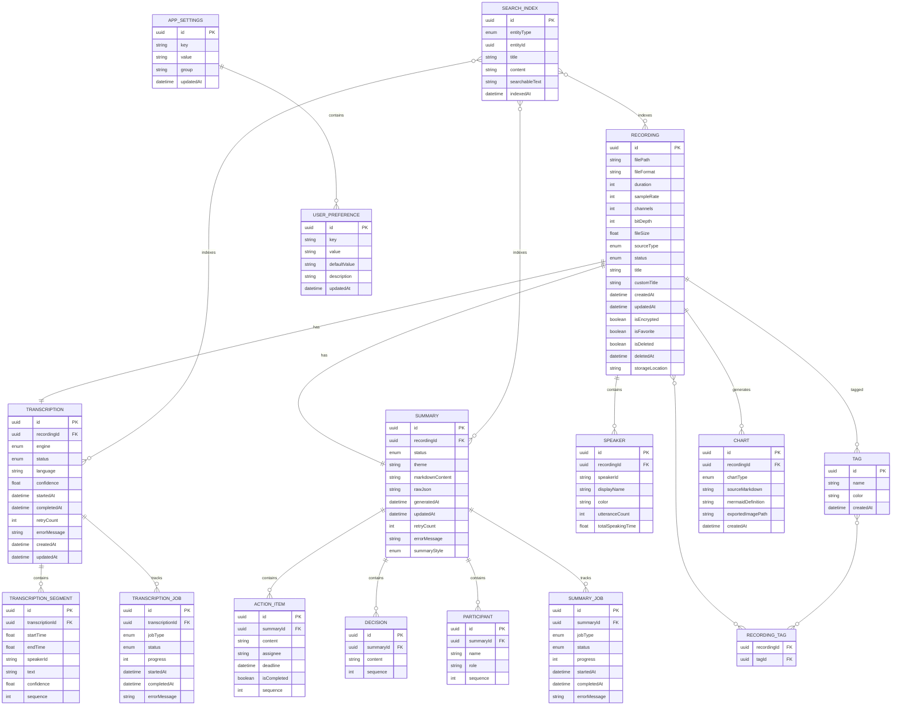

# AI 录音助手 — 数据库设计文档（Database Design）

## 版本信息

| 项目 | 内容 |
|------|------|
| 文档版本 | v1.0 |
| 撰写日期 | 2026/05/28 |
| 对应 PRD | PRD-v1.0.md |
| 对应 Tech Spec | TechSpec-v1.0.md |
| 文档状态 | 已确认，可直接指导开发 |

---

## 1. 数据库选型决策

### 1.1 决策结果：SQLite + Core Data

| 候选方案 | 评估 | 结论 |
|----------|------|------|
| **SQLite + Core Data** | 系统原生支持，与 Swift/SwiftUI 深度集成，支持 FTS5 全文搜索，支持数据迁移，性能满足需求 | **选中** |
| 纯 SQLite (GRDB/SQLite.swift) | 更灵活，但需手动管理对象关系，开发成本较高 | 备选 |
| Realm | 性能好，但引入第三方依赖，包体积增加 ~10MB | 不选 |
| Core Data (非 SQLite 后端) | 默认 SQLite 后端已满足需求，无需特殊配置 | 同选中方案 |

### 1.2 选型理由

1. **原生集成**：Core Data 是 Apple 官方 ORM，与 SwiftUI `@FetchRequest` 无缝配合，开发效率高
2. **全文搜索**：SQLite FTS5 支持高效的全文检索，满足转录文本和纪要内容的搜索需求
3. **数据迁移**：Core Data 内置轻量级迁移（Lightweight Migration），支持版本升级时自动迁移
4. **性能**：实测 Core Data + SQLite 在 10 万条记录场景下查询 < 100ms，满足产品需求
5. **零依赖**：无需引入第三方数据库库，减少包体积和维护成本
6. **加密支持**：通过 SQLCipher（可选）或文件系统加密实现数据安全

---

## 2. 数据库架构概览

### 2.1 ER 图（实体关系图）



### 2.2 数据库文件结构

```
~/Library/Application Support/AIRecording/
├── Database/
│   ├── main.sqlite              # Core Data 主数据库
│   ├── main.sqlite-shm          # SQLite shared memory
│   ├── main.sqlite-wal          # SQLite write-ahead log
│   └── search_index.sqlite      # FTS5 全文搜索索引（可选独立）
├── Recordings/
│   ├── 2026/
│   │   ├── 05/
│   │   │   ├── recording_xxx.caf
│   │   │   └── recording_xxx.wav
│   └── ...
├── Charts/
│   └── chart_xxx.png
└── Backups/
    └── auto_backup_20260528.zip
```

---

## 3. 表结构定义

### 3.1 录音表（Recording）

存储录音文件的核心元数据。

```sql
CREATE TABLE Recording (
    id              TEXT PRIMARY KEY,           -- UUID v4
    filePath        TEXT NOT NULL,              -- 音频文件绝对路径
    fileFormat      TEXT NOT NULL DEFAULT 'wav', -- wav / caf / flac
    duration        INTEGER NOT NULL DEFAULT 0, -- 时长（秒）
    sampleRate      INTEGER NOT NULL DEFAULT 44100, -- 采样率（Hz）
    channels        INTEGER NOT NULL DEFAULT 1, -- 声道数（1=单声道, 2=立体声）
    bitDepth        INTEGER NOT NULL DEFAULT 16, -- 位深度（16/24）
    fileSize        REAL NOT NULL DEFAULT 0,    -- 文件大小（字节）
    sourceType      INTEGER NOT NULL DEFAULT 0, -- 0=麦克风, 1=系统音频, 2=混合
    status          INTEGER NOT NULL DEFAULT 0, -- 0=录制中, 1=已完成, 2=处理中, 3=错误
    title           TEXT,                       -- 自动生成的标题
    customTitle     TEXT,                       -- 用户自定义标题
    createdAt       REAL NOT NULL,              -- 创建时间（Unix 时间戳，毫秒）
    updatedAt       REAL NOT NULL,              -- 更新时间（Unix 时间戳，毫秒）
    isEncrypted     INTEGER NOT NULL DEFAULT 0, -- 是否加密存储（0/1）
    isFavorite      INTEGER NOT NULL DEFAULT 0, -- 是否收藏（0/1）
    isDeleted       INTEGER NOT NULL DEFAULT 0, -- 软删除标记（0/1）
    deletedAt       REAL,                       -- 删除时间
    storageLocation TEXT NOT NULL DEFAULT 'default' -- 存储位置标识
);

-- 索引
CREATE INDEX idx_recording_createdAt ON Recording(createdAt DESC);
CREATE INDEX idx_recording_status ON Recording(status);
CREATE INDEX idx_recording_isDeleted ON Recording(isDeleted);
CREATE INDEX idx_recording_isFavorite ON Recording(isFavorite);
CREATE INDEX idx_recording_sourceType ON Recording(sourceType);
```

**Core Data 模型定义（伪代码）**：

```swift
@objc(Recording)
public class Recording: NSManagedObject {
    @NSManaged public var id: UUID
    @NSManaged public var filePath: String
    @NSManaged public var fileFormat: String
    @NSManaged public var duration: Int32
    @NSManaged public var sampleRate: Int32
    @NSManaged public var channels: Int32
    @NSManaged public var bitDepth: Int32
    @NSManaged public var fileSize: Double
    @NSManaged public var sourceType: Int16
    @NSManaged public var status: Int16
    @NSManaged public var title: String?
    @NSManaged public var customTitle: String?
    @NSManaged public var createdAt: Date
    @NSManaged public var updatedAt: Date
    @NSManaged public var isEncrypted: Bool
    @NSManaged public var isFavorite: Bool
    @NSManaged public var isDeleted: Bool
    @NSManaged public var deletedAt: Date?
    @NSManaged public var storageLocation: String
    
    // 关系
    @NSManaged public var transcription: Transcription?
    @NSManaged public var summary: Summary?
    @NSManaged public var speakers: NSSet?
    @NSManaged public var charts: NSSet?
    @NSManaged public var tags: NSSet?
}
```

### 3.2 转录表（Transcription）

存储转录任务和结果摘要。

```sql
CREATE TABLE Transcription (
    id              TEXT PRIMARY KEY,           -- UUID v4
    recordingId     TEXT NOT NULL UNIQUE,       -- 关联录音（一对一）
    engine          INTEGER NOT NULL DEFAULT 0, -- 0=AppleSpeech, 1=Whisper, 2=WhisperTiny
    status          INTEGER NOT NULL DEFAULT 0, -- 0=待处理, 1=处理中, 2=已完成, 3=失败
    language        TEXT,                       -- 识别语言（zh-CN / en-US / auto）
    confidence      REAL,                       -- 平均置信度（0.0-1.0）
    startedAt       REAL,                       -- 开始时间
    completedAt     REAL,                       -- 完成时间
    retryCount      INTEGER NOT NULL DEFAULT 0, -- 重试次数
    errorMessage    TEXT,                       -- 错误信息
    createdAt       REAL NOT NULL,
    updatedAt       REAL NOT NULL,
    
    FOREIGN KEY (recordingId) REFERENCES Recording(id) ON DELETE CASCADE
);

CREATE INDEX idx_transcription_recordingId ON Transcription(recordingId);
CREATE INDEX idx_transcription_status ON Transcription(status);
CREATE INDEX idx_transcription_engine ON Transcription(engine);
```

### 3.3 转录片段表（TranscriptionSegment）

存储转录的文本片段，按时间顺序排列。

```sql
CREATE TABLE TranscriptionSegment (
    id              TEXT PRIMARY KEY,           -- UUID v4
    transcriptionId TEXT NOT NULL,              -- 关联转录
    startTime       REAL NOT NULL,              -- 开始时间（秒，相对于录音起点）
    endTime         REAL NOT NULL,              -- 结束时间（秒）
    speakerId       TEXT,                       -- 说话人标识（如 "SPEAKER_00"）
    text            TEXT NOT NULL,              -- 转录文本
    confidence      REAL,                       -- 该片段置信度
    sequence        INTEGER NOT NULL,           -- 顺序号（用于排序）
    
    FOREIGN KEY (transcriptionId) REFERENCES Transcription(id) ON DELETE CASCADE
);

CREATE INDEX idx_segment_transcriptionId ON TranscriptionSegment(transcriptionId);
CREATE INDEX idx_segment_startTime ON TranscriptionSegment(startTime);
CREATE INDEX idx_segment_speakerId ON TranscriptionSegment(speakerId);
CREATE INDEX idx_segment_sequence ON TranscriptionSegment(sequence);
```

### 3.4 说话人表（Speaker）

存储录音中识别出的说话人信息。

```sql
CREATE TABLE Speaker (
    id              TEXT PRIMARY KEY,
    recordingId     TEXT NOT NULL,              -- 关联录音
    speakerId       TEXT NOT NULL,              -- 原始标识符（如 "SPEAKER_00"）
    displayName     TEXT,                       -- 用户自定义显示名称
    color           TEXT,                       -- UI 显示颜色（hex）
    utteranceCount  INTEGER NOT NULL DEFAULT 0, -- 发言次数
    totalSpeakingTime REAL NOT NULL DEFAULT 0,  -- 总发言时长（秒）
    
    FOREIGN KEY (recordingId) REFERENCES Recording(id) ON DELETE CASCADE
);

CREATE INDEX idx_speaker_recordingId ON Speaker(recordingId);
CREATE UNIQUE INDEX idx_speaker_recording_speakerId ON Speaker(recordingId, speakerId);
```

### 3.5 纪要表（Summary）

存储 AI 生成的会议纪要。

```sql
CREATE TABLE Summary (
    id              TEXT PRIMARY KEY,
    recordingId     TEXT NOT NULL UNIQUE,       -- 关联录音（一对一）
    status          INTEGER NOT NULL DEFAULT 0, -- 0=待生成, 1=生成中, 2=已完成, 3=失败
    theme           TEXT,                       -- 会议主题
    markdownContent TEXT,                       -- 完整 Markdown 纪要
    rawJson         TEXT,                       -- AI 返回的原始 JSON
    generatedAt     REAL,                       -- 生成时间
    updatedAt       REAL NOT NULL,
    retryCount      INTEGER NOT NULL DEFAULT 0,
    errorMessage    TEXT,
    summaryStyle    INTEGER NOT NULL DEFAULT 0, -- 0=详细版, 1=简洁版, 2=待办清单版
    
    FOREIGN KEY (recordingId) REFERENCES Recording(id) ON DELETE CASCADE
);

CREATE INDEX idx_summary_recordingId ON Summary(recordingId);
CREATE INDEX idx_summary_status ON Summary(status);
```

### 3.6 待办事项表（ActionItem）

存储纪要中提取的待办事项。

```sql
CREATE TABLE ActionItem (
    id              TEXT PRIMARY KEY,
    summaryId       TEXT NOT NULL,              -- 关联纪要
    content         TEXT NOT NULL,              -- 事项内容
    assignee        TEXT,                       -- 负责人
    deadline        TEXT,                       -- 截止日期（ISO 8601）
    isCompleted     INTEGER NOT NULL DEFAULT 0, -- 是否完成
    sequence        INTEGER NOT NULL,           -- 顺序号
    
    FOREIGN KEY (summaryId) REFERENCES Summary(id) ON DELETE CASCADE
);

CREATE INDEX idx_actionItem_summaryId ON ActionItem(summaryId);
CREATE INDEX idx_actionItem_isCompleted ON ActionItem(isCompleted);
```

### 3.7 决策表（Decision）

存储纪要中提取的关键决策。

```sql
CREATE TABLE Decision (
    id              TEXT PRIMARY KEY,
    summaryId       TEXT NOT NULL,
    content         TEXT NOT NULL,
    sequence        INTEGER NOT NULL,
    
    FOREIGN KEY (summaryId) REFERENCES Summary(id) ON DELETE CASCADE
);

CREATE INDEX idx_decision_summaryId ON Decision(summaryId);
```

### 3.8 参与人表（Participant）

存储纪要中识别的参与人。

```sql
CREATE TABLE Participant (
    id              TEXT PRIMARY KEY,
    summaryId       TEXT NOT NULL,
    name            TEXT NOT NULL,
    role            TEXT,                       -- 角色（如 "主持人"、"记录人"）
    sequence        INTEGER NOT NULL,
    
    FOREIGN KEY (summaryId) REFERENCES Summary(id) ON DELETE CASCADE
);

CREATE INDEX idx_participant_summaryId ON Participant(summaryId);
```

### 3.9 图表表（Chart）

存储生成的图表。

```sql
CREATE TABLE Chart (
    id              TEXT PRIMARY KEY,
    recordingId     TEXT NOT NULL,              -- 关联录音
    chartType       INTEGER NOT NULL DEFAULT 0, -- 0=思维导图, 1=流程图, 2=时间线
    sourceMarkdown  TEXT,                       -- 生成图表的源 Markdown
    mermaidDefinition TEXT,                     -- Mermaid 语法定义
    exportedImagePath TEXT,                     -- 导出图片路径
    createdAt       REAL NOT NULL,
    
    FOREIGN KEY (recordingId) REFERENCES Recording(id) ON DELETE CASCADE
);

CREATE INDEX idx_chart_recordingId ON Chart(recordingId);
CREATE INDEX idx_chart_chartType ON Chart(chartType);
```

### 3.10 标签表（Tag）

存储用户自定义标签。

```sql
CREATE TABLE Tag (
    id              TEXT PRIMARY KEY,
    name            TEXT NOT NULL UNIQUE,       -- 标签名称
    color           TEXT NOT NULL DEFAULT '#007AFF', -- 标签颜色
    createdAt       REAL NOT NULL
);

CREATE INDEX idx_tag_name ON Tag(name);
```

### 3.11 录音标签关联表（RecordingTag）

录音与标签的多对多关联。

```sql
CREATE TABLE RecordingTag (
    recordingId     TEXT NOT NULL,
    tagId           TEXT NOT NULL,
    
    PRIMARY KEY (recordingId, tagId),
    FOREIGN KEY (recordingId) REFERENCES Recording(id) ON DELETE CASCADE,
    FOREIGN KEY (tagId) REFERENCES Tag(id) ON DELETE CASCADE
);

CREATE INDEX idx_recordingTag_tagId ON RecordingTag(tagId);
```

### 3.12 应用设置表（AppSettings）

存储应用级别的配置项。

```sql
CREATE TABLE AppSettings (
    id              TEXT PRIMARY KEY,
    key             TEXT NOT NULL UNIQUE,       -- 配置键
    value           TEXT,                       -- 配置值（JSON 字符串）
    group           TEXT NOT NULL DEFAULT 'general', -- 配置分组
    updatedAt       REAL NOT NULL
);

CREATE INDEX idx_appSettings_key ON AppSettings(key);
CREATE INDEX idx_appSettings_group ON AppSettings(group);
```

### 3.13 用户偏好表（UserPreference）

存储用户可修改的偏好设置，带默认值。

```sql
CREATE TABLE UserPreference (
    id              TEXT PRIMARY KEY,
    key             TEXT NOT NULL UNIQUE,       -- 偏好键
    value           TEXT,                       -- 当前值
    defaultValue    TEXT NOT NULL,              -- 默认值
    description     TEXT,                       -- 描述（用于 UI 展示）
    updatedAt       REAL NOT NULL
);

CREATE INDEX idx_userPreference_key ON UserPreference(key);
```

### 3.14 转录任务队列表（TranscriptionJob）

跟踪转录任务的执行状态，支持断点续传。

```sql
CREATE TABLE TranscriptionJob (
    id              TEXT PRIMARY KEY,
    transcriptionId TEXT NOT NULL,              -- 关联转录
    jobType         INTEGER NOT NULL DEFAULT 0, -- 0=语音识别, 1=说话人分离, 2=后处理
    status          INTEGER NOT NULL DEFAULT 0, -- 0=待执行, 1=执行中, 2=已完成, 3=失败, 4=取消
    progress        INTEGER NOT NULL DEFAULT 0, -- 进度（0-100）
    startedAt       REAL,                       -- 开始时间
    completedAt     REAL,                       -- 完成时间
    errorMessage    TEXT,
    
    FOREIGN KEY (transcriptionId) REFERENCES Transcription(id) ON DELETE CASCADE
);

CREATE INDEX idx_transcriptionJob_transcriptionId ON TranscriptionJob(transcriptionId);
CREATE INDEX idx_transcriptionJob_status ON TranscriptionJob(status);
```

### 3.15 纪要任务队列表（SummaryJob）

跟踪纪要生成任务的执行状态。

```sql
CREATE TABLE SummaryJob (
    id              TEXT PRIMARY KEY,
    summaryId       TEXT NOT NULL,              -- 关联纪要
    jobType         INTEGER NOT NULL DEFAULT 0, -- 0=文本预处理, 1=AI 生成, 2=后处理
    status          INTEGER NOT NULL DEFAULT 0, -- 0=待执行, 1=执行中, 2=已完成, 3=失败, 4=取消
    progress        INTEGER NOT NULL DEFAULT 0,
    startedAt       REAL,
    completedAt     REAL,
    errorMessage    TEXT,
    
    FOREIGN KEY (summaryId) REFERENCES Summary(id) ON DELETE CASCADE
);

CREATE INDEX idx_summaryJob_summaryId ON SummaryJob(summaryId);
CREATE INDEX idx_summaryJob_status ON SummaryJob(status);
```

### 3.16 全文搜索索引表（SearchIndex）

使用 SQLite FTS5 实现全文搜索。

```sql
-- 虚拟表，使用 FTS5 扩展
CREATE VIRTUAL TABLE SearchIndex USING fts5(
    entityType,         -- 实体类型（recording / transcription / summary）
    entityId,           -- 实体 ID
    title,              -- 标题
    content,            -- 可搜索内容
    searchableText,     -- 合并后的搜索文本
    indexedAt,          -- 索引时间
    tokenize = 'porter unicode61'
);

-- 普通表用于维护索引与实体的映射
CREATE TABLE SearchIndexMapping (
    id              TEXT PRIMARY KEY,
    entityType      TEXT NOT NULL,
    entityId        TEXT NOT NULL,
    ftsDocId        INTEGER NOT NULL,           -- FTS5 内部 docid
    lastIndexedAt   REAL NOT NULL,
    
    UNIQUE(entityType, entityId)
);

CREATE INDEX idx_searchMapping_entity ON SearchIndexMapping(entityType, entityId);
```

---

## 4. 预设配置数据

### 4.1 默认用户偏好

```sql
INSERT INTO UserPreference (id, key, value, defaultValue, description, updatedAt) VALUES
('pref-001', 'recording.sampleRate', '44100', '44100', '录音采样率（Hz）', 0),
('pref-002', 'recording.format', 'wav', 'wav', '录音格式（wav / caf / flac）', 0),
('pref-003', 'recording.channels', '1', '1', '录音声道数（1=单声道, 2=立体声）', 0),
('pref-004', 'recording.bitDepth', '16', '16', '录音位深度（16/24）', 0),
('pref-005', 'transcription.defaultLanguage', 'auto', 'auto', '默认转录语言', 0),
('pref-006', 'transcription.engine', 'appleSpeech', 'appleSpeech', '默认转录引擎', 0),
('pref-007', 'transcription.enhancedMode', 'false', 'false', '是否启用增强识别模式', 0),
('pref-008', 'summary.style', 'detailed', 'detailed', '纪要风格（detailed / concise / actionItems）', 0),
('pref-009', 'summary.cloudEnabled', 'true', 'true', '是否启用云端 AI 生成纪要', 0),
('pref-010', 'storage.location', 'default', 'default', '录音文件存储位置', 0),
('pref-011', 'storage.encryptionEnabled', 'false', 'false', '是否启用录音文件加密', 0),
('pref-012', 'ui.theme', 'system', 'system', '界面主题（system / light / dark）', 0),
('pref-013', 'shortcut.startRecording', '⌘⇧R', '⌘⇧R', '开始录音快捷键', 0),
('pref-014', 'shortcut.stopRecording', '⌘⇧S', '⌘⇧S', '停止录音快捷键', 0);
```

---

## 5. 数据迁移策略

### 5.1 版本管理

采用 Core Data 轻量级迁移 + 自定义迁移脚本的双层策略：

| 场景 | 策略 |
|------|------|
| 增加新属性（可空）| 轻量级迁移（自动）|
| 增加新实体 | 轻量级迁移（自动）|
| 删除属性 | 轻量级迁移（自动，数据丢失）|
| 属性类型变更 | 自定义映射模型 |
| 数据格式变更 | 自定义 NSEntityMigrationPolicy |
| 跨大版本升级 | 导出 → 重建 → 导入 |

### 5.2 迁移版本历史

```
Model Version History:
v1.0 (初始版本)
  ├── Recording
  ├── Transcription
  ├── TranscriptionSegment
  ├── Speaker
  ├── Summary
  ├── ActionItem
  ├── Decision
  ├── Participant
  ├── Chart
  ├── Tag
  ├── RecordingTag
  ├── AppSettings
  ├── UserPreference
  ├── TranscriptionJob
  ├── SummaryJob
  └── SearchIndex
```

### 5.3 迁移实现

```swift
// Core Data 堆栈初始化时配置迁移
lazy var persistentContainer: NSPersistentContainer = {
    let container = NSPersistentContainer(name: "AIRecording")
    
    // 启用轻量级迁移
    let description = container.persistentStoreDescriptions.first
    description?.setOption(true as NSNumber, forKey: NSMigratePersistentStoresAutomaticallyOption)
    description?.setOption(true as NSNumber, forKey: NSInferMappingModelAutomaticallyOption)
    
    container.loadPersistentStores { _, error in
        if let error = error {
            fatalError("Failed to load Core Data: \(error)")
        }
    }
    return container
}()
```

### 5.4 降级处理

- 应用降级（新版本 → 旧版本）时，旧版本应忽略未知字段，不报错
- 建议在数据库中保留 `schemaVersion` 字段，便于未来检测不兼容降级

---

## 6. 备份与恢复机制

### 6.1 自动备份策略

| 触发条件 | 备份内容 | 保留策略 |
|----------|----------|----------|
| 应用退出时（如果数据有变更）| 完整数据库 + 录音文件元数据 | 保留最近 5 个版本 |
| 每周一次（定时任务）| 完整数据库 + 录音文件元数据 | 保留最近 4 周 |
| 用户手动触发 | 完整数据库 + 选定录音文件 | 用户指定位置 |

### 6.2 备份格式

```
backup_20260528_143052.airecording
├── manifest.json              # 备份元数据（版本、时间、内容清单）
├── database/
│   └── main.sqlite            # 数据库文件
└── recordings/
    └── [按原目录结构存储音频文件]
```

### 6.3 备份实现

```swift
class BackupManager {
    /// 创建备份
    func createBackup(includeRecordings: Bool) throws -> URL
    
    /// 恢复备份
    func restoreBackup(from url: URL) throws
    
    /// 列出可用备份
    func listBackups() -> [BackupInfo]
    
    /// 清理旧备份
    func cleanupOldBackups(keepCount: Int)
}
```

### 6.4 数据导出

支持将单个录音导出为结构化数据包：

```
export_recording_xxx.zip
├── recording.json             # 录音元数据
├── audio.wav                  # 音频文件
├── transcription.json         # 转录结果
├── summary.md                 # 纪要 Markdown
└── charts/
    └── mindmap.png
```

---

## 7. 性能优化

### 7.1 索引策略

| 表 | 索引字段 | 用途 |
|----|----------|------|
| Recording | createdAt DESC | 列表按时间排序 |
| Recording | status | 筛选处理中/已完成 |
| Recording | isDeleted | 软删除过滤 |
| TranscriptionSegment | transcriptionId + sequence | 按顺序读取片段 |
| TranscriptionSegment | startTime | 时间戳跳转 |
| SearchIndex | FTS5 内置索引 | 全文搜索 |

### 7.2 查询优化

```swift
// 录音列表分页查询
func fetchRecordings(page: Int, pageSize: Int) -> [Recording] {
    let request: NSFetchRequest<Recording> = Recording.fetchRequest()
    request.predicate = NSPredicate(format: "isDeleted == false")
    request.sortDescriptors = [NSSortDescriptor(key: "createdAt", ascending: false)]
    request.fetchLimit = pageSize
    request.fetchOffset = page * pageSize
    return try! context.fetch(request)
}

// 全文搜索
func searchRecordings(query: String) -> [SearchResult] {
    let sql = """
        SELECT si.entityId, si.title, si.searchableText 
        FROM SearchIndex si 
        WHERE searchableText MATCH ?
        ORDER BY rank
        LIMIT 50
        """
    // 执行 FTS5 查询
}
```

### 7.3 批量操作

```swift
// 批量删除旧录音（超过 30 天且未收藏）
func cleanupOldRecordings() {
    context.perform {
        let batchDelete = NSBatchDeleteRequest(
            fetchRequest: NSFetchRequest<NSFetchRequestResult>(entityName: "Recording")
        )
        batchDelete.predicate = NSPredicate(format: "createdAt < %@ AND isFavorite == false", cutoffDate)
        try? context.execute(batchDelete)
    }
}
```

---

## 8. 数据安全

### 8.1 加密策略

| 层级 | 方案 | 触发条件 |
|------|------|----------|
| 数据库文件 | SQLCipher（可选）| 用户开启"加密存储" |
| 音频文件 | AES-256-GCM | 用户开启"加密存储" |
| API Key | Keychain | 始终 |
| 备份文件 | ZIP + AES-256 密码 | 用户设置密码时 |

### 8.2 音频文件加密

```swift
class AudioEncryption {
    /// 加密音频文件
    func encryptFile(at sourceURL: URL, to destinationURL: URL, using key: SymmetricKey) throws
    
    /// 解密音频文件到临时位置（播放时）
    func decryptFile(at sourceURL: URL, to destinationURL: URL, using key: SymmetricKey) throws
    
    /// 流式解密（边下边播）
    func decryptStream(from sourceURL: URL, using key: SymmetricKey) -> InputStream
}
```

---

## 9. 数据生命周期

### 9.1 录音数据生命周期

```
录制中 → 录制完成 → 转录中 → 转录完成 → 纪要生成中 → 纪要完成
  │          │           │           │            │           │
  │          │           │           │            │           └── 长期存储
  │          │           │           │            └── 失败时可重试
  │          │           │           └── 失败时可重试 / 手动编辑
  │          │           └── 失败时可重试 / 切换引擎
  │          └── 自动触发转录（如设置开启）
  └── 实时写入 CAF，崩溃后可恢复
```

### 9.2 数据保留策略

| 数据类型 | 默认保留 | 自动清理 | 用户控制 |
|----------|----------|----------|----------|
| 录音文件 | 永久 | 可选（超过 N 天未收藏）| 手动删除 |
| 转录文本 | 永久 | 随录音删除 | 手动删除 |
| 纪要 | 永久 | 随录音删除 | 手动删除 |
| 任务日志 | 30 天 | 自动清理超过 30 天 | 不可控 |
| 搜索索引 | 永久 | 随实体删除 | 不可控 |
| 缓存文件 | 7 天 | 自动清理 | 不可控 |

---

## 10. 数据库初始化流程

```swift
class DatabaseInitializer {
    func initialize() throws {
        // 1. 加载 Core Data 模型
        let container = NSPersistentContainer(name: "AIRecording")
        
        // 2. 配置存储（启用 WAL 模式提升并发性能）
        if let description = container.persistentStoreDescriptions.first {
            description.setOption(true as NSNumber, forKey: NSPersistentStoreRemoteChangeNotificationPostOptionKey)
            description.setValue("WAL" as NSString, forPragmaNamed: "journal_mode")
            description.setValue("1" as NSString, forPragmaNamed: "foreign_keys")
        }
        
        // 3. 加载存储
        container.loadPersistentStores { _, error in
            if let error = error { throw error }
        }
        
        // 4. 检查并插入默认配置
        try seedDefaultPreferences()
        
        // 5. 创建 FTS5 索引（如果不存在）
        try createFTS5Index()
        
        // 6. 执行数据迁移（如有需要）
        try runMigrations()
    }
}
```

---

## 11. 与 Tech Spec 的对应关系

| Tech Spec 模块 | 数据库对应 |
|---------------|-----------|
| 录音模块 | Recording 表 |
| 转录模块 | Transcription + TranscriptionSegment + Speaker 表 |
| 纪要模块 | Summary + ActionItem + Decision + Participant 表 |
| 图表模块 | Chart 表 |
| 历史模块 | Recording 表 + SearchIndex 虚拟表 |
| 设置模块 | AppSettings + UserPreference 表 |
| 任务队列 | TranscriptionJob + SummaryJob 表 |
| 标签系统 | Tag + RecordingTag 表 |
