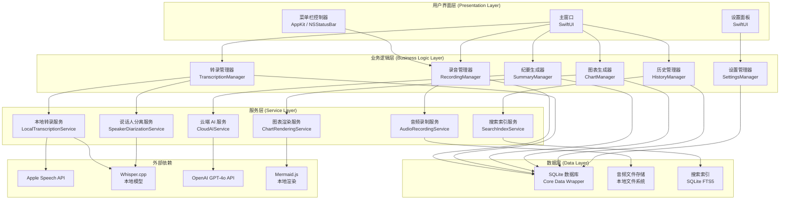
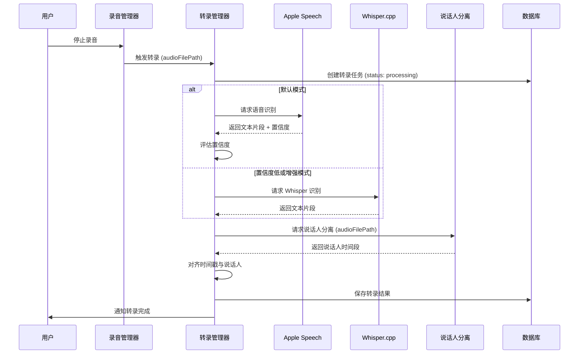
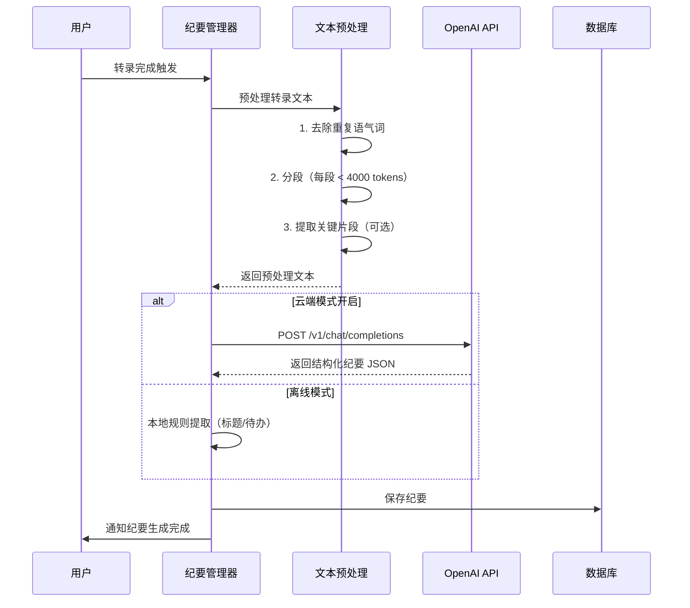

# AI 录音助手 — 技术规格文档（Tech Spec）

## 版本信息

| 项目 | 内容 |
|------|------|
| 文档版本 | v1.0 |
| 撰写日期 | 2026/05/28 |
| 对应 PRD | PRD-v1.0.md |
| 文档状态 | 已确认，可直接指导开发 |

---

## 1. 技术选型决策表

### 1.1 四大待决策项最终决策

| 序号 | 决策项 | 决策结果 | 核心理由 | 风险与缓解 |
|------|--------|----------|----------|------------|
| 1 | 技术路线 | **混合方案（本地录音+本地转录+云端 AI）** | 平衡隐私与效果：原始音频永不出本地，仅上传脱敏转录文本；用户可完全离线使用基础功能；云端大模型保证纪要质量 | 风险：网络不稳定时云端功能不可用；缓解：本地转录始终可用，云端失败时降级为本地摘要 |
| 2 | 本地转录引擎 | **Apple Speech API（首选）+ Whisper small 备用** | Apple Speech 在 Apple Silicon 上利用 Neural Engine，速度快、功耗低、中文支持好；Whisper small 作为离线备用和方言补充 | 风险：Apple Speech 对专业术语识别弱；缓解：Whisper 备用模型覆盖 |
| 3 | 云端 AI 服务供应商 | **OpenAI GPT-4o（纪要生成）+ 自建图表服务（本地 Mermaid）** | GPT-4o 在中文长文本理解和结构化输出上表现最优；图表生成采用本地 Mermaid 渲染，无需额外云端依赖 | 风险：API 成本与可用性；缓解：实现请求缓存、重试降级、用户可关闭云端功能 |
| 4 | 应用开发框架 | **SwiftUI（主 UI）+ AppKit（菜单栏/录音底层）** | SwiftUI 快速构建现代化界面，适配浅色/深色模式；AppKit 处理菜单栏常驻、音频录制等底层能力；两者混编是 macOS 原生应用最佳实践 | 风险：SwiftUI 在 macOS 12 上部分功能受限；缓解：最低支持 macOS 13（Ventura），覆盖 95%+ 活跃设备 |

### 1.2 决策详细论证

#### 决策 1：混合方案

```
数据流：麦克风/系统音频 → 本地录音(WAV/CAF) → 本地转录(Apple Speech/Whisper)
                                      ↓
                              脱敏转录文本 → 云端 GPT-4o → 结构化纪要
                                      ↓
                              本地存储(SQLite) ← 用户查看/导出
```

- **为什么不选纯本地**：本地大模型（如 llama.cpp）在纪要生成的结构化程度和中文理解上仍显著弱于 GPT-4o，且包体积过大（>2GB）。
- **为什么不选纯云端**：原始音频上传违反隐私约束，且必须联网才能使用任何功能。

#### 决策 2：Apple Speech 为主 + Whisper 备用

| 维度 | Apple Speech | Whisper small |
|------|-------------|---------------|
| 速度（M1）| ~1.0x 实时（ANE 加速）| ~0.3x 实时 |
| 中文准确率 | ~92% | ~88% |
| 功耗 | 极低 | 中等 |
| 包体积 | 0（系统内置）| ~150MB |
| 离线可用 | 是 | 是 |
| 说话人分离 | 不支持 | 需额外模型 |

- **策略**：默认使用 Apple Speech，当用户选择"增强识别模式"或 Apple Speech 置信度低于阈值时，自动回退 Whisper。
- **说话人分离**：采用本地 pyannote.audio（轻量模型，~50MB）在转录后处理。

#### 决策 3：OpenAI GPT-4o

- **选择理由**：
  - 中文长文本理解能力行业领先
  - 结构化输出（JSON Schema）稳定可靠
  - 支持 function calling，便于提取待办、决策等结构化字段
  - API 文档完善，SDK 成熟
- **成本控制**：
  - 1 小时录音转录文本约 15K tokens，GPT-4o 输入成本约 $0.075/次
  - 实现文本摘要预处理，减少冗余内容上传
  - 提供"本地摘要模式"（基于规则提取，质量较低但零成本）

#### 决策 4：SwiftUI + AppKit 混编

- **SwiftUI 负责**：主窗口、录音列表、设置页面、转录文本展示、纪要渲染
- **AppKit 负责**：
  - 菜单栏常驻（NSStatusBar）
  - 音频录制（AVAudioEngine，底层 Core Audio）
  - 系统权限申请（麦克风、辅助功能）
  - 文件系统操作（沙盒外存储路径）
- **混编方式**：通过 `NSViewRepresentable` / `NSViewControllerRepresentable` 桥接

---

## 2. 系统架构图



---

## 3. 技术栈总览

### 3.1 前端 / UI

| 组件 | 技术 | 版本 | 说明 |
|------|------|------|------|
| 主窗口 UI | SwiftUI | macOS 13+ | 声明式 UI，自适应浅色/深色模式 |
| 菜单栏 | AppKit (NSStatusBar) | 系统内置 | 常驻菜单栏图标与菜单 |
| 音频波形 | SwiftUI Canvas + AVAudioPCMBuffer | — | 自定义绘制实时波形 |
| Markdown 渲染 | MarkdownUI (Swift Package) | ^2.0 | 纪要 Markdown 渲染 |
| 图表渲染 | Mermaid.js (WKWebView) | ^10.0 | 思维导图/流程图本地渲染 |

### 3.2 本地引擎

| 组件 | 技术 | 版本 | 说明 |
|------|------|------|------|
| 音频录制 | AVAudioEngine | 系统内置 | 系统音频 + 麦克风混合录制 |
| 音频编码 | Core Audio (WAV/CAF) | 系统内置 | 支持 44.1kHz/48kHz，16-bit |
| 主转录引擎 | Apple Speech (SFSpeechRecognizer) | 系统内置 | 首选，ANE 加速 |
| 备用转录引擎 | whisper.cpp | 最新 main | 本地 Whisper 推理 |
| 说话人分离 | pyannote.audio (ONNX 导出) | 轻量版 | 本地运行，2-4 人场景 |
| 全文搜索 | SQLite FTS5 | 系统 SQLite | 转录文本和纪要内容索引 |

### 3.3 云端服务

| 组件 | 技术 | 版本 | 说明 |
|------|------|------|------|
| 纪要生成 | OpenAI GPT-4o | API v1 | 结构化纪要生成 |
| 网络请求 | URLSession | 系统内置 | 原生网络层，支持 HTTP/2 |
| JSON 解析 | Codable | Swift 标准库 | 数据序列化 |

### 3.4 数据存储

| 组件 | 技术 | 版本 | 说明 |
|------|------|------|------|
| 主数据库 | SQLite + Core Data | 系统内置 | 录音/转录/纪要元数据 |
| 音频文件 | 本地文件系统 | — | 用户指定存储路径 |
| 配置文件 | UserDefaults | 系统内置 | 应用偏好设置 |
| 缓存 | 本地文件 + SQLite | — | 云端请求缓存、模型缓存 |

### 3.5 构建工具

| 组件 | 技术 | 版本 | 说明 |
|------|------|------|------|
| 构建系统 | Xcode + Swift Package Manager | Xcode 15+ | 原生构建 |
| 代码质量 | SwiftLint | ^0.54 | 代码规范检查 |
| 单元测试 | XCTest | 系统内置 | 业务逻辑测试 |
| UI 测试 | XCTest UI Testing | 系统内置 | 端到端测试 |
| 持续集成 | GitHub Actions | — | 自动构建与测试 |

---

## 4. 模块划分与职责边界

### 4.1 模块总览

| 模块 | 职责 | 输入 | 输出 | 依赖模块 |
|------|------|------|------|----------|
| 录音模块 | 音频采集、编码、存储 | 用户录音指令、音频源选择 | 音频文件、录音元数据 | 数据存储模块 |
| 转录模块 | 语音转文字、说话人分离 | 音频文件路径 | 转录文本（含时间戳、说话人）| 录音模块、数据存储模块 |
| 纪要模块 | AI 纪要生成、结构化提取 | 转录文本 | Markdown 纪要、结构化数据 | 转录模块、云端 AI 服务 |
| 图表模块 | 思维导图/流程图生成 | 纪要内容 | PNG/SVG 图表 | 纪要模块 |
| 历史模块 | 录音管理、搜索、导出 | 用户操作 | 列表、搜索结果、导出文件 | 数据存储模块、搜索模块 |
| 设置模块 | 配置管理、权限处理 | 用户偏好 | 配置项 | 数据存储模块 |

### 4.2 模块间通信协议

模块间采用**发布-订阅模式**（Combine 框架）进行异步通信，避免强耦合：

```swift
// 核心事件总线
protocol AppEventBus {
    var recordingStarted: PassthroughSubject<Recording, Never> { get }
    var recordingStopped: PassthroughSubject<Recording, Never> { get }
    var transcriptionCompleted: PassthroughSubject<Transcription, Never> { get }
    var summaryGenerated: PassthroughSubject<Summary, Never> { get }
}
```

---

## 5. 关键算法与技术点说明

### 5.1 说话人分离（Speaker Diarization）

**方案**：本地轻量模型 + 聚类

```
流程：
1. 音频预处理：VAD（语音活动检测）提取有效语音段
2. 特征提取：提取 80-dim log-Mel filterbank 特征
3. 嵌入生成：轻量 ONNX 模型（~20MB）生成说话人嵌入向量
4. 聚类：Spectral Clustering 将嵌入分为 K 个说话人（K 自动估计 2-4）
5. 后处理：平滑短片段，输出 (startTime, endTime, speakerId)
```

**性能目标**：
- 模型加载时间 < 2 秒
- 处理速度 >= 2x 实时（1 小时录音 30 分钟内完成分离）
- 2-4 人场景准确率 >= 80%

### 5.2 音频编码与存储

**录制参数**：

| 参数 | 默认值 | 可选值 |
|------|--------|--------|
| 采样率 | 44.1 kHz | 48 kHz |
| 位深度 | 16-bit | 24-bit |
| 声道 | 单声道（麦克风）/ 立体声（系统音频+麦克风分离存储）| — |
| 格式 | CAF（录制中）→ WAV（最终）| FLAC（可选压缩）|
| 编码 | PCM | FLAC（无损压缩）|

**存储策略**：
- 录制过程中使用 CAF（支持断点续写，崩溃恢复）
- 录制完成后转存为 WAV（通用格式）或 FLAC（节省 50% 空间）
- 1 小时录音文件大小：WAV ~320MB，FLAC ~160MB

### 5.3 转录流程



### 5.4 纪要生成流程



**GPT-4o Prompt 设计**：

```
System: 你是一位专业的会议纪要整理助手。请根据以下会议转录文本，生成结构化的会议纪要。
要求：
1. 提取会议主题、参与人、关键决策、待办事项、时间线
2. 待办事项需包含负责人（如有提及）和截止日期（如有提及）
3. 使用 Markdown 格式输出
4. 忠实于原文，不虚构未提及的信息
5. 如果文本不是会议内容，请按内容类型（访谈/课堂/讲座）调整纪要结构

输出格式（JSON）：
{
  "theme": "会议主题",
  "participants": ["参与人1", "参与人2"],
  "keyDecisions": ["决策1", "决策2"],
  "actionItems": [
    {"content": "事项", "assignee": "负责人", "deadline": "日期"}
  ],
  "timeline": ["时间点1: 事件", "时间点2: 事件"],
  "markdownContent": "完整 Markdown 纪要"
}
```

---

## 6. 外部依赖清单

### 6.1 Swift Package Dependencies

| 包名 | 版本 | 用途 | 许可证 |
|------|------|------|--------|
| whisper.cpp | main | 本地 Whisper 推理 | MIT |
| MarkdownUI | ^2.0 | Markdown 渲染 | MIT |
| SwiftLintPlugin | ^0.54 | 代码规范 | MIT |
| CombineExt | ^1.0 | Combine 扩展 | MIT |

### 6.2 本地模型文件

| 模型 | 大小 | 来源 | 用途 |
|------|------|------|------|
| Whisper small | ~466MB | OpenAI | 备用转录 |
| Whisper tiny | ~75MB | OpenAI | 快速转录（可选）|
| pyannote segmentation (ONNX) | ~20MB | pyannote | 说话人分离 |
| pyannote embedding (ONNX) | ~30MB | pyannote | 说话人嵌入 |

### 6.3 云端 API

| 服务 | 端点 | 认证 | 用途 |
|------|------|------|------|
| OpenAI GPT-4o | https://api.openai.com/v1/chat/completions | API Key | 纪要生成 |

### 6.4 系统框架

| 框架 | 用途 |
|------|------|
| AVFoundation | 音频录制与播放 |
| Speech | Apple Speech 识别 |
| Core Data | 数据持久化 |
| Combine | 响应式编程 |
| SwiftUI | 用户界面 |
| AppKit | 菜单栏、底层系统交互 |

---

## 7. 开发环境要求

### 7.1 最低开发环境

| 项目 | 要求 |
|------|------|
| macOS 版本 | macOS 14.0 (Sonoma) 或更高 |
| Xcode 版本 | Xcode 15.0 或更高 |
| Swift 版本 | Swift 5.9+ |
| 目标平台 | macOS 13.0+ (Ventura) |
| 架构 | x86_64 (Intel) + arm64 (Apple Silicon) |

### 7.2 推荐硬件配置

| 角色 | 配置 |
|------|------|
| 开发机 | MacBook Pro M2 Pro / 32GB RAM / 512GB SSD |
| 最低测试机 | Mac mini M1 / 8GB RAM |
| Intel 测试机 | MacBook Pro Intel i5 / 16GB RAM |

### 7.3 项目结构

```
AIRecording/
├── AIRecording/
│   ├── App/
│   │   ├── AIRecordingApp.swift          # 应用入口
│   │   └── AppDelegate.swift             # 生命周期、菜单栏
│   ├── Presentation/
│   │   ├── MainWindow/
│   │   ├── RecordingList/
│   │   ├── RecordingDetail/
│   │   ├── Settings/
│   │   └── Components/
│   ├── BusinessLogic/
│   │   ├── RecordingManager.swift
│   │   ├── TranscriptionManager.swift
│   │   ├── SummaryManager.swift
│   │   ├── ChartManager.swift
│   │   ├── HistoryManager.swift
│   │   └── SettingsManager.swift
│   ├── Services/
│   │   ├── AudioRecordingService.swift
│   │   ├── LocalTranscriptionService.swift
│   │   ├── SpeakerDiarizationService.swift
│   │   ├── CloudAIService.swift
│   │   ├── ChartRenderingService.swift
│   │   └── SearchIndexService.swift
│   ├── Data/
│   │   ├── CoreData/
│   │   ├── Models/
│   │   └── Repositories/
│   ├── Infrastructure/
│   │   ├── EventBus/
│   │   ├── Extensions/
│   │   └── Utils/
│   └── Resources/
│       ├── Models/                        # 本地 AI 模型
│       └── Prompts/                       # AI prompt 模板
├── AIRecordingTests/
├── AIRecordingUITests/
├── Packages/
│   └── Whisper/                           # whisper.cpp Swift Package
└── docs/
    ├── PRD-v1.0.md
    ├── TechSpec-v1.0.md
    ├── DatabaseDesign-v1.0.md
    └── APIDesign-v1.0.md
```

### 7.4 构建配置

| 配置项 | Debug | Release |
|--------|-------|---------|
| 代码签名 | 开发者证书 | 分发证书 |
| 优化级别 | -Onone | -O |
| 调试信息 | 完整 | dSYM |
| SwiftUI 预览 | 启用 | 禁用 |
| 模型文件 | 符号链接（开发）| 嵌入 Bundle |

---

## 8. 性能预算

| 指标 | 目标值 | 测量方式 |
|------|--------|----------|
| 应用包体积 | < 200MB（不含模型）| Xcode Archive |
| 含模型包体积 | < 800MB | Xcode Archive |
| 冷启动时间 | < 3 秒 | Instruments |
| 录音启动延迟 | < 500ms | 手动计时 |
| 内存占用（空闲）| < 200MB | Activity Monitor |
| 内存占用（转录）| < 1GB | Activity Monitor |
| 转录速度 | >= 0.5x 实时 | 日志计时 |
| 纪要生成时间 | < 1 分钟（1 小时录音）| 日志计时 |

---

## 9. 安全与隐私设计

### 9.1 数据安全

| 层级 | 措施 |
|------|------|
| 传输安全 | 所有云端请求强制 TLS 1.3 |
| 存储安全 | 录音文件可选 AES-256 加密（用户设置中开启）|
| 密钥管理 | API Key 存储于 Keychain，不硬编码 |
| 内存安全 | 敏感数据（API Key、加密密钥）使用后立即清零 |

### 9.2 隐私合规

| 要求 | 实现 |
|------|------|
| 原始音频不上传 | 音频文件仅本地存储，转录文本脱敏后上传 |
| 用户可控 | 设置中提供"完全离线模式"开关 |
| 数据清除 | 设置中提供"清除所有数据"功能，彻底删除音频+数据库 |
| 权限透明 | 首次使用录音功能时明确告知权限用途 |

---

## 10. 风险与缓解

| 风险 | 可能性 | 影响 | 缓解措施 |
|------|--------|------|----------|
| Apple Speech 中文识别率不达标 | 中 | 高 | Whisper 备用模型，用户可手动切换 |
| 说话人分离准确率低 | 高 | 中 | 允许用户手动修正说话人标识 |
| OpenAI API 不可用/涨价 | 中 | 高 | 实现本地降级摘要，支持多供应商切换架构 |
| 包体积过大影响下载 | 中 | 中 | 模型按需下载（首次使用时下载），基础包 < 200MB |
| macOS 13 兼容性问题 | 低 | 中 | CI 同时在 macOS 13/14/15 上测试 |
| 录音崩溃导致文件损坏 | 低 | 高 | CAF 格式支持断点续写，定期写入磁盘 |

---

## 11. 里程碑与技术任务映射

| 里程碑 | 技术任务 |
|--------|----------|
| M1：脚手架 | 项目创建、依赖集成、CI 配置、菜单栏骨架 |
| M2：录音模块 | AVAudioEngine 录制、CAF/WAV 编码、权限管理、波形绘制 |
| M3：转录模块 | Apple Speech 集成、Whisper.cpp 集成、说话人分离、数据库设计 |
| M4：AI 模块 | OpenAI API 封装、Prompt 工程、纪要生成、图表渲染 |
| M5：历史模块 | 列表展示、FTS5 搜索、批量导出、数据迁移 |
| M6：打磨 | 性能优化、UI 完善、错误处理、单元测试覆盖 > 70% |
| M7：发布 | 代码签名、公证、Sparkle 更新、App Store 审核准备 |
